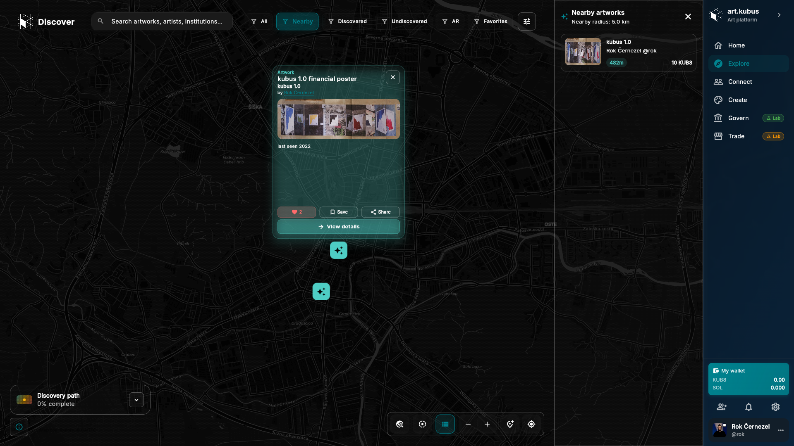
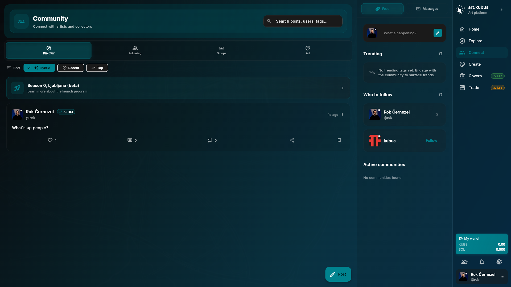
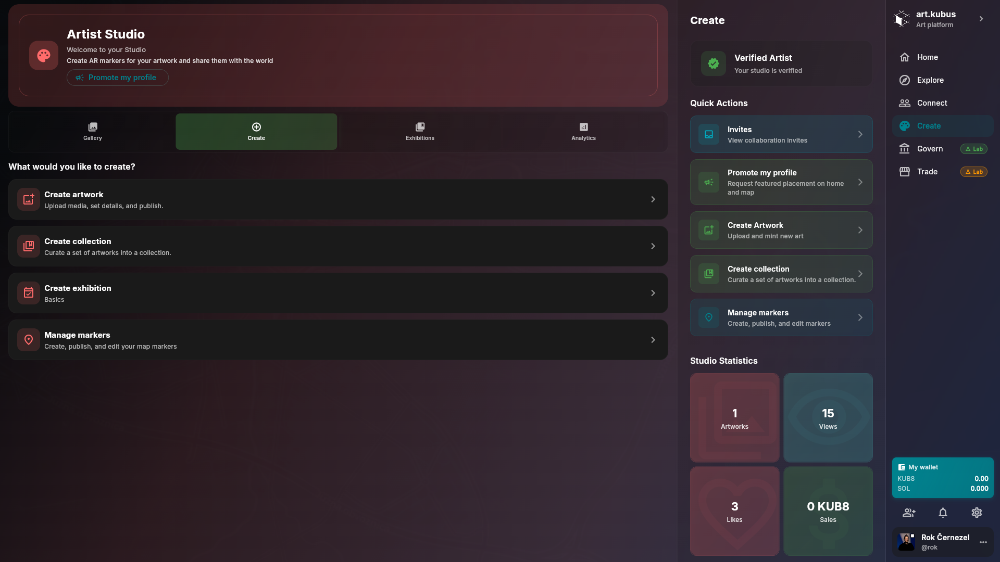
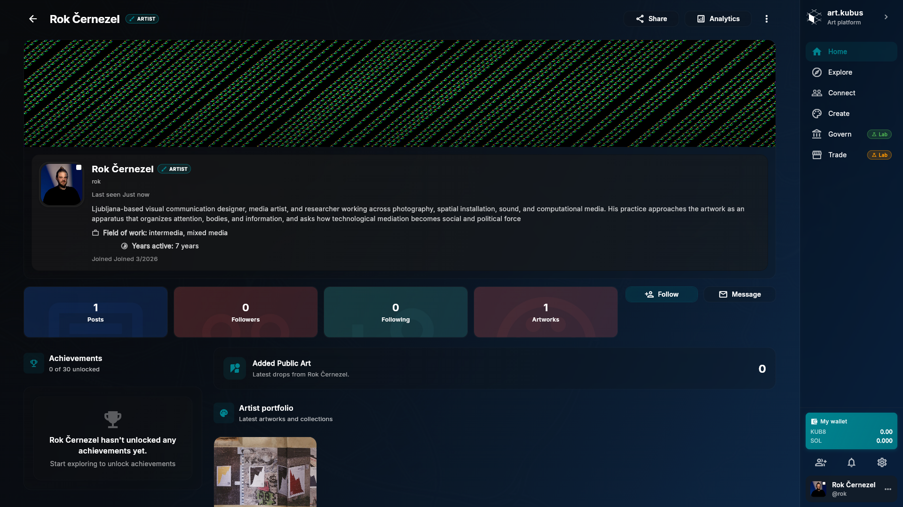
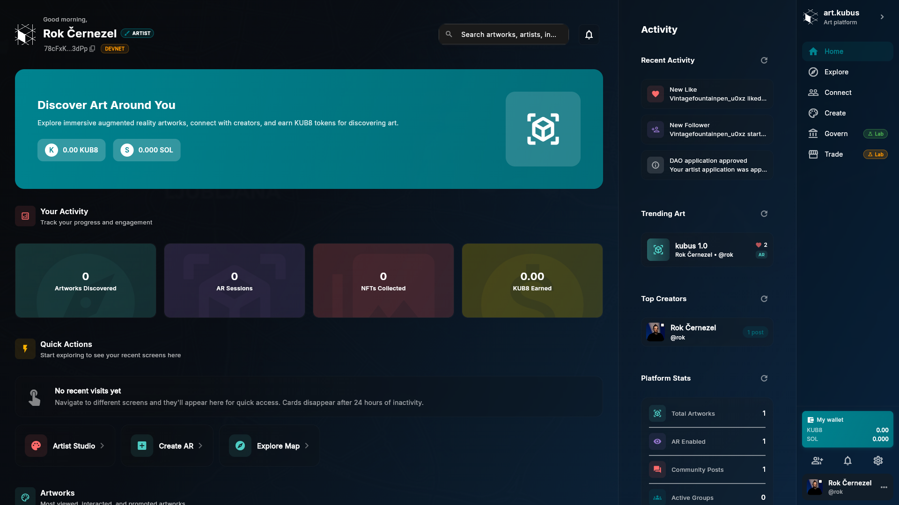
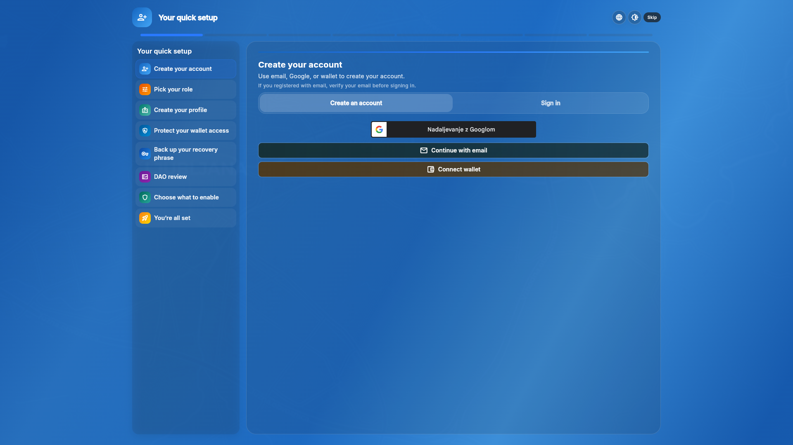
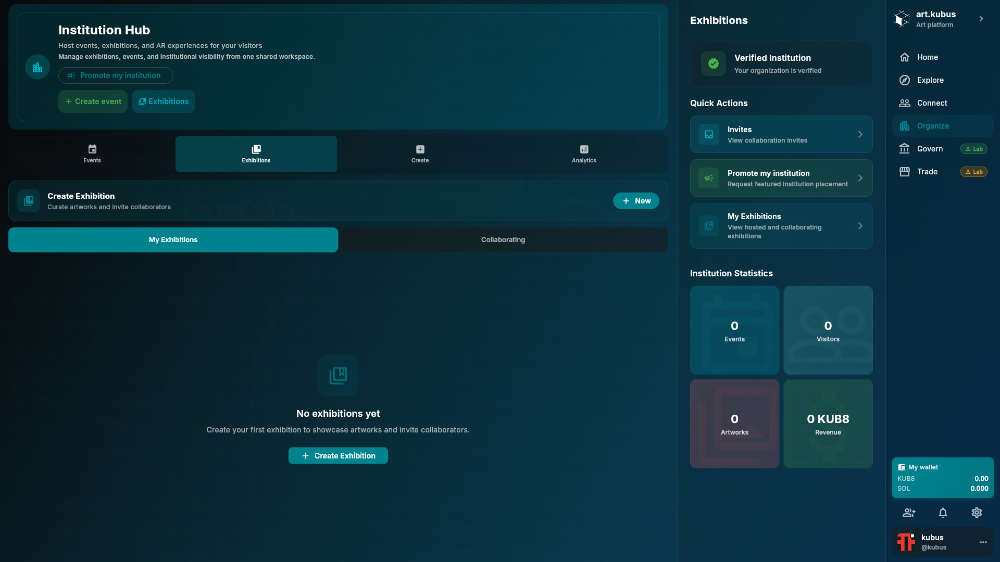

<p align="center">
  
</p>

# art.kubus

[](https://flutter.dev)
[](LICENSE)

A cross-platform Flutter app for discovering public and street art on a map — community-first, with optional AR and wallet-connected experiences.

The client emphasizes map-based discovery (MapLibre) alongside community workflows (profiles, posts, following, and reporting). AR experiences are mobile-focused, while institution and wallet-connected surfaces are available when enabled via feature flags and supported by the backend.

Project site: https://art.kubus.site · App site: https://app.kubus.site

## Platforms

- Android / iOS
- Web
- Windows / macOS / Linux

> AR experiences are mobile-focused; web/desktop builds prioritize discovery and community workflows.

## What this repository contains

- `lib/`, `assets/`, `android/`, `ios/`, `web/`, `windows/`, … — the Flutter client (Apache-2.0)
- `docs/` — client documentation and the open-platform boundary (start at [`docs/README.md`](docs/README.md))
- `backend/` — platform backend for local development / reference (not Apache-2.0; see [`backend/README.md`](backend/README.md))

## Quick start

Prereqs: Flutter (Dart >= 3.6).

```bash
flutter pub get
flutter run
```

Build (examples):

```bash
flutter build web
flutter build apk --release
```

### Point the app at a backend

The client reads its API base URL from build-time defines (see `lib/config/config.dart`):

```bash
flutter run --dart-define=BACKEND_BASE_URL=https://api.kubus.site
```

For deeper setup (platform prerequisites, troubleshooting, backend setup), use [`docs/GETTING_STARTED.md`](docs/GETTING_STARTED.md).

## Documentation

- Docs index: [`docs/README.md`](docs/README.md)
- Getting started: [`docs/GETTING_STARTED.md`](docs/GETTING_STARTED.md)
- Features: [`docs/FEATURES.md`](docs/FEATURES.md)
- Screens: [`docs/SCREENS.md`](docs/SCREENS.md)
- Architecture: [`docs/ARCHITECTURE.md`](docs/ARCHITECTURE.md)
- Open platform scope: [`docs/OPEN_PLATFORM.md`](docs/OPEN_PLATFORM.md)

## Interface overview

The following figures illustrate key user-facing surfaces in the current client build.

### Map-based discovery (marker open)

<p align="center">
  
</p>

The map view provides a spatial entry point for discovery. Users can search across artworks, artists, and institutions; refine results via discovery filters (e.g., nearby, discovered/undiscovered); and open markers to inspect an artwork card before navigating to full details.

### Community

<p align="center">
  
</p>

The community surface supports social discovery for posts, people, and topics. It provides feed browsing with multiple sorting modes, search across posts/users/tags, and pathways to follow creators and initiate conversations.

### Artist Studio

<p align="center">
  
</p>

Artist Studio is the creator-oriented workspace for publishing and managing content. It centralizes creation flows (artworks, collections, exhibitions) and marker management used for map discovery, alongside collaboration and promotion-oriented actions where enabled.

### Profile

<p align="center">
  
</p>

Profiles function as public identity surfaces, combining a short biography with activity/portfolio context. They foreground artworks and collections, surface social connectivity (followers/following), and provide direct actions such as following or messaging.

### Home

<p align="center">
  
</p>

Home acts as a lightweight dashboard: it aggregates quick actions into common flows (e.g., studio, map, AR where enabled), summarizes recent activity, and provides discovery shortcuts such as trending artworks and creators.

### Onboarding

<p align="center">
  
</p>

Onboarding provides a guided setup sequence for new accounts. It includes account creation or sign-in, role selection and profile basics, and optional wallet connection and feature enablement when those capabilities are configured.

### Institution Hub

<p align="center">
  
</p>

Institution Hub is the institution-facing workspace for hosting exhibitions and events. Availability depends on backend endpoints and feature flags; when enabled, it supports creation/management flows, coordination via invites and visibility requests, and basic institution-level summaries.

## Project status

Active development. Expect rapid iteration and occasional breaking changes while the client and platform harden.

## Contributing, support, and policies

- Contributing: [`CONTRIBUTING.md`](CONTRIBUTING.md)
- Support: [`SUPPORT.md`](SUPPORT.md)
- Security: [`SECURITY.md`](SECURITY.md)
- Governance: [`GOVERNANCE.md`](GOVERNANCE.md)

Licensing notes:

- Client code: [`LICENSE`](LICENSE) (Apache-2.0) + [`NOTICE`](NOTICE)
- Trademarks/branding: [`TRADEMARK.md`](TRADEMARK.md)
- Assets/content: [`LICENSE_ASSETS.md`](LICENSE_ASSETS.md)
