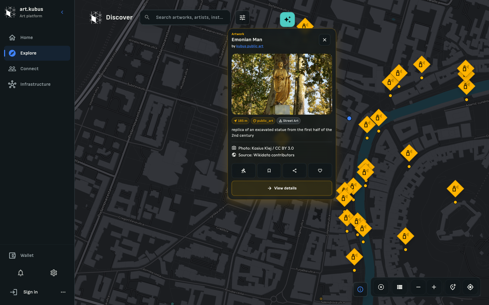
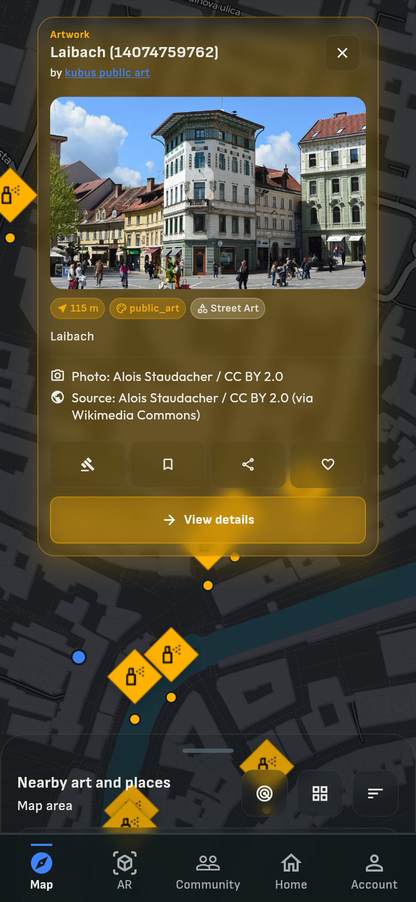
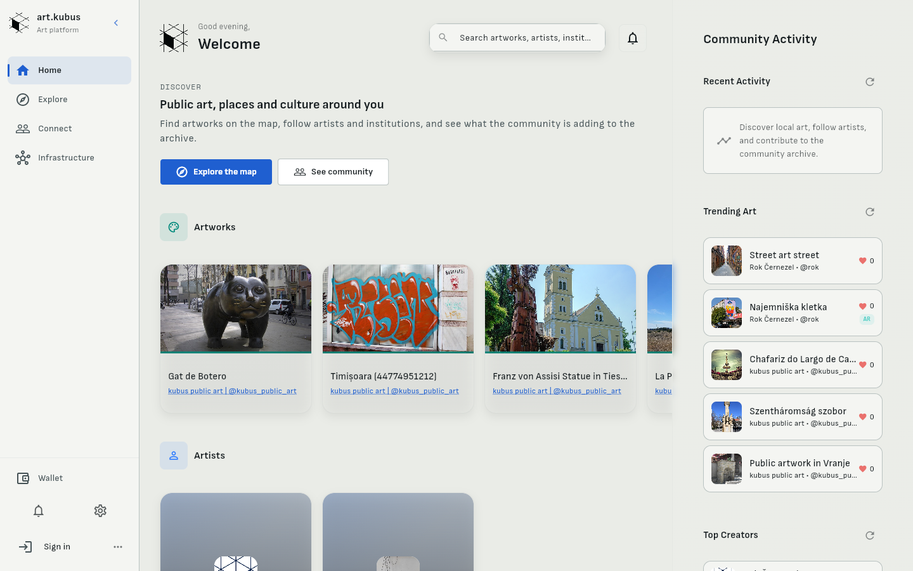

<p align="center">
  
</p>

<h1 align="center">art.kubus</h1>

<p align="center">
  <strong>An open-source map for discovering, documenting and connecting public art.</strong><br />
  A cross-platform Flutter app built on MapLibre, with community tools, optional AR and optional decentralized infrastructure.
</p>

<p align="center">
  <a href="https://flutter.dev"></a>
  <a href="https://maplibre.org"></a>
  <a href="#license"></a>
  <a href="#status"></a>
</p>

<p align="center">
  <a href="https://app.kubus.site"><strong>Try it live</strong></a> ·
  <a href="docs/README.md">Documentation</a> ·
  <a href="CONTRIBUTING.md">Contribute</a> ·
  <a href="https://github.com/kubus-project/art.kubus/discussions">Discussions</a> ·
  <a href="https://art.kubus.site">Project site</a>
</p>

<p align="center">
  
</p>

<p align="center"><sub>The map on web, guest session, real public data. The photo credit and source shown in the card come from the artwork record.</sub></p>

## What is art.kubus?

art.kubus puts public and street art on a map. You can find works near you or anywhere else, see who made them and where the record came from, save and share them, and follow the artists and institutions behind them. Artists and institutions publish their own work, exhibitions and events. The community adds, corrects and discusses what is out there.

The same Flutter codebase runs on Android, iOS, web, Windows, macOS and Linux. The map uses [MapLibre](https://maplibre.org) with the project's own vector styles over OpenStreetMap-based tiles. AR, wallets and the kubus Node spatial archive are optional layers on top of that. You do not need them to browse the map or join the community.

If art.kubus is useful or interesting to you, consider starring the repository. It helps more contributors find the project.

## Capabilities

| Area | What works today |
| --- | --- |
| Map discovery | MapLibre map with search across artworks, artists and institutions, discovery filters, nearby lists, marker cards with source and photo attribution, a discovery path, and light and dark map styles |
| Community | Feed, groups, posts, comments, following, messaging and reporting |
| Artists | Artist Studio for publishing artworks, collections and exhibitions, and for managing map markers and AR markers |
| Institutions | Institution Hub for exhibitions and events, available after verification |
| AR (optional) | Marker-based AR on Android (ARCore) and iOS (ARKit); web and desktop link to the mobile app instead |
| Spatial archive (optional) | Spatial captures of artworks, processed on a paired [kubus Node](https://github.com/kubus-project/kubus-node) or an eligible network GPU, and published only when the author chooses |
| Wallet and governance (optional) | Solana wallet via Reown AppKit, plus experimental marketplace and DAO features |
| Languages | English and Slovenian, with complete key parity |

Most optional features are gated by build-time feature flags in [`lib/config/config.dart`](lib/config/config.dart) and depend on the hosted API. See [`docs/FEATURES.md`](docs/FEATURES.md) for detail.

## Interface

<table>
  <tr>
    <td width="30%" valign="top">
      
    </td>
    <td width="70%" valign="top">
      
    </td>
  </tr>
  <tr>
    <td valign="top"><sub>Mobile map with an artwork opened from the nearby sheet.</sub></td>
    <td valign="top"><sub>Desktop home: discovery entry points, artworks and community activity.</sub></td>
  </tr>
</table>

More surfaces, including community, Artist Studio, profiles and Institution Hub, are described in [`docs/SCREENS.md`](docs/SCREENS.md). [`docs/SCREENSHOTS.md`](docs/SCREENSHOTS.md) explains how these images are captured.

## Quick start

Prerequisites: Flutter 3.44.2 (pinned in [`.fvmrc`](.fvmrc)) and Git. AR needs a physical ARCore or ARKit device.

```bash
git clone https://github.com/kubus-project/art.kubus.git
cd art.kubus
flutter pub get
flutter run -d chrome        # or an Android/iOS device, windows, macos, linux
```

With no configuration, the app talks to the public API at `https://api.kubus.site`, so you can browse real public content straight away. To point it at another backend:

```bash
flutter run -d chrome --dart-define=BACKEND_BASE_URL=http://localhost:3000
```

Before opening a pull request:

```bash
flutter analyze
flutter test
```

Platform setup, troubleshooting and backend notes are in [`docs/GETTING_STARTED.md`](docs/GETTING_STARTED.md).

## Architecture

art.kubus is not a purely decentralized system today. The hosted API is the primary source of truth. Decentralized parts are optional and additive, and the project is moving toward more of them over time.

```text
 art.kubus Flutter client (this repository, MPL-2.0)
   Android · iOS · web · Windows · macOS · Linux
   MapLibre map · Provider state · en/sl localization
        │
        │ REST + WebSocket
        ▼
 art.kubus API  (api.kubus.site, standby bapi.kubus.site)
   implemented in art.kubus-backend: separate repository,
   separate licensing, included here as the backend/ submodule
        │
        └─ database, media and moderation run on hosted infrastructure

 Optional, additive layers
   Solana wallet (Reown AppKit)       wallet, marketplace, DAO features
   kubus Node (AGPL-3.0-only)         spatial processing and public archive participation
   IPFS / IPNS public snapshot        read-only fallback when both API endpoints are unreachable
   ARCore / ARKit                     on-device AR on mobile
```

Inside the client, screens and widgets sit on `ChangeNotifier` providers, which call services for API, map, AR and wallet work. [`docs/ARCHITECTURE.md`](docs/ARCHITECTURE.md) covers the boot sequence and module layout, and [`docs/OPEN_PLATFORM.md`](docs/OPEN_PLATFORM.md) covers what is open and what is hosted.

### Repository layout

| Path | Contents |
| --- | --- |
| `lib/` | Flutter client: `screens/`, `widgets/`, `providers/`, `services/`, `models/`, `config/`, `l10n/` |
| `assets/` | Images, fonts, map styles (`assets/map_styles/`) and marker art |
| `android/`, `ios/`, `web/`, `windows/`, `macos/`, `linux/` | Platform runners |
| `test/` | Unit and widget tests, plus opt-in visual QA matrices under `test/qa/` |
| `packages/kubus_lints/` | Project-specific lint rules (theme tokens, raw colors, backdrop filters) |
| `scripts/` | CI guards, verification and Playwright web QA (`scripts/qa/`) |
| `docs/` | Developer documentation, starting at [`docs/README.md`](docs/README.md) |
| `backend/` | Git submodule for `art.kubus-backend`. Private, not needed to run the client |

## Status

art.kubus is in alpha and under active development. Expect frequent changes, including occasional breaking ones.

- The integration branch is `dev`. Production releases are promoted from `dev` to `master`.
- The client version on `dev` is **0.8.0** ([release notes draft](docs/release-0.8.0.md)).
- The latest published release is on the [releases page](https://github.com/kubus-project/art.kubus/releases).
- Hosted builds: [app.kubus.site](https://app.kubus.site) (production).

## Contributing

Contributions are welcome, including code, documentation, translations, accessibility fixes and bug reports.

1. Read [`CONTRIBUTING.md`](CONTRIBUTING.md) for setup, conventions and the PR flow.
2. Pick a [`good first issue`](https://github.com/kubus-project/art.kubus/labels/good%20first%20issue) or a [`help wanted`](https://github.com/kubus-project/art.kubus/labels/help%20wanted) issue.
3. Ask questions in [Discussions](https://github.com/kubus-project/art.kubus/discussions) (Q&A for help, Ideas for proposals).

Project policies: [Code of Conduct](CODE_OF_CONDUCT.md) · [Governance](GOVERNANCE.md) · [Support](SUPPORT.md) · [Security](SECURITY.md) (report vulnerabilities privately, not in issues).

## Background

art.kubus is also a research and development project. It looks at how digital cultural infrastructure, spatial interfaces, participation, AR and decentralization can support public art and the people and institutions around it. The project site at [art.kubus.site](https://art.kubus.site) has more on that side of the work.

## License

The code in this repository is licensed in parts:

| Part | Terms |
| --- | --- |
| The Flutter client and everything else in this repository not listed below | [MPL-2.0](LICENSE), see also [`NOTICE`](NOTICE) |
| Files explicitly marked as public platform API artifacts | Apache-2.0, where marked |
| Vendored third-party code (for example `third_party/`, `web/local/maplibre-gl`) | Upstream licenses, see [`THIRD_PARTY_NOTICES.md`](THIRD_PARTY_NOTICES.md) |
| `backend/` submodule | Separate repository with its own terms. Not MPL-2.0 |
| Names, logos and branding | Not licensed by the above, see [`TRADEMARK.md`](TRADEMARK.md) |
| Images, media and user or institutional content | See [`LICENSE_ASSETS.md`](LICENSE_ASSETS.md) |

[`docs/licensing.md`](docs/licensing.md) gives a plain-language overview of the whole ecosystem, including kubus Node (AGPL-3.0-only).
